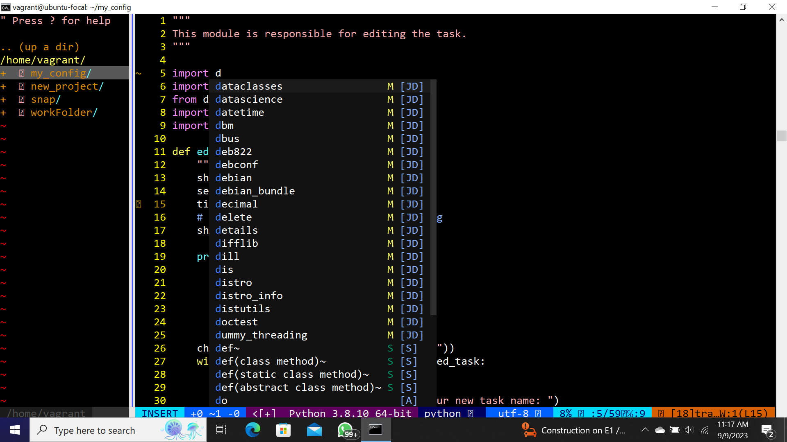

# Config files for BASH, NVIM, VIM and COC Extensions.

# How to install Neovim
These are the steps to install neovim on your linux(ubuntu) system.
You can install it by using the apt command like this:
###
    sudo apt-get install neovim

**But i recommend to install neovim with an appimage as shown below:**
###
    curl -LO https://github.com/neovim/neovim/releases/download/nightly/nvim.appimage
    chmod u+x nvim.appimage
    mv nvim.appimage nv
    sudo mv nv /usr/bin/
    nv

After this if you want to use neovim, you just have to type in "nv" on your terminal
###
    nv

# Making use of my configuration For NVIM.
After cloning this repository run the command below inside the repository
###
    mkdir -p ~/.config/nvim
    cp init.vim ~/.config/nvim/

# Some features of my NVIM(my shell text editor i.e VIM).
With my configuration you can do/have the following, not all are mentioned here you might need the help of chatGPT:
1. You would be able to use autocompletion in C, Python and your text files.
2. You can hve your terminal with the press of F6.
3. With ctrl+t you can toggle you file panel/nerdtree.
4. You can automatically wrap your codes.
5. You can see git changes on your file due to the git integration.
6. You have access to Variety of colorschemes and also have number displayed and mouse enabled, you paste by shift+right click.
7. You can move lines of code by selecting and pressing j or k on your keyboard to move down or up.
8. You coding errors would be indicated, there is a syntax/error checker.

These are some features i can remember, I install plugins and map keys to make it easier for me to use but you would like my Configuration. 
# How to install VIM Plug
###
    curl -fLo ~/.config/nvim/autoload/plug.vim --create-dirs \
        https://raw.githubusercontent.com/junegunn/vim-plug/master/plug.vim

This vim plug is necessary because it is the plugin manager of neovim and vim without it you can't install plugins necessary to configure your vim

**with VIM plug installed for neovim and my config files, You can then use the command below to install the plugins.**
###
    :PlugInstall

You might have to install nodejs because a plugin like neoclide COC plugin which is used for autocompletion and is connected to LSP would need it. On your terminal run the command below, it would ensure you have the nodejs installed and the necessay version needed for the plugins to work with no error:
###
    sudo apt install nodejs
###
    curl -o- https://raw.githubusercontent.com/nvm-sh/nvm/v0.38.0/install.sh | bash
    source ~/.bashrc
###
    nvm install v18.15.0

# Additional Notes for Neovim Config.
You can make use of these steps below because you have my configuration file for nvim, if you do not have my config files you might have to make some changes in your init.vim configuration file.

## For C/C++ configuration of COC.
To fully enable C/C++ auto complete on neovim then Clangd must be installed on the terminal
this can be done by using the command.
run this in your terminal:
###
    sudo apt install Clangd
    
Then you can install the COC extension below in your command mode of neovim
###
    :CocInstall coc-c
    :CocInstall coc-snippets

## Python Configuration of COC
###
    :CocInstall coc-python

Run this on your neovim terminal afterwards install jedi module for python with the command below on your terminal. Now i am assuming you have pip3 installed but if you don't then you can install it with this command
###
    sudo apt install python3-pip
###
    pip install jedi

# Support
If you found this repository helpful and you would like to appreciate me you can do that by 
1. **Subscribing to this Youtube Channel** link is [HERE](https://youtube.com/@ConquerorDevs?si=FnVhOo1Z-EHSWxbQ)
2. You can star this repository, so it can be recommended to others on Github.
3. You can follow my github account and share this repository.

# Author
The Author is yours truly, [MYSELF](https://github.com/ConquerorCletus).
